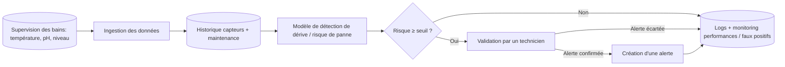

# Schéma d'architecture cible — ton cas

> Mini-cours `05`. Renomme en `schema_archi_cible.md`. ≥ 4 composants, flux de
> données, où se trouvent les traitements de tes risques 🔴 (revue humaine,
> pseudonymisation, journalisation).

**Composants** : supervision des bains, ingestion des données, historique des capteurs et des interventions de maintenance, modèle de détection de dérive / risque de panne, validation par un technicien, système d'alerte et suivi des performances.

**Ce qu'on n'a PAS mis** (et pourquoi) : pas de LLM, pas de RAG, pas de base vectorielle ni de système multi-agents, car le besoin repose sur des données numériques temporelles et ne nécessite pas de traitement de langage. Pas de décision automatique de maintenance non plus : le technicien garde la validation finale avant intervention.